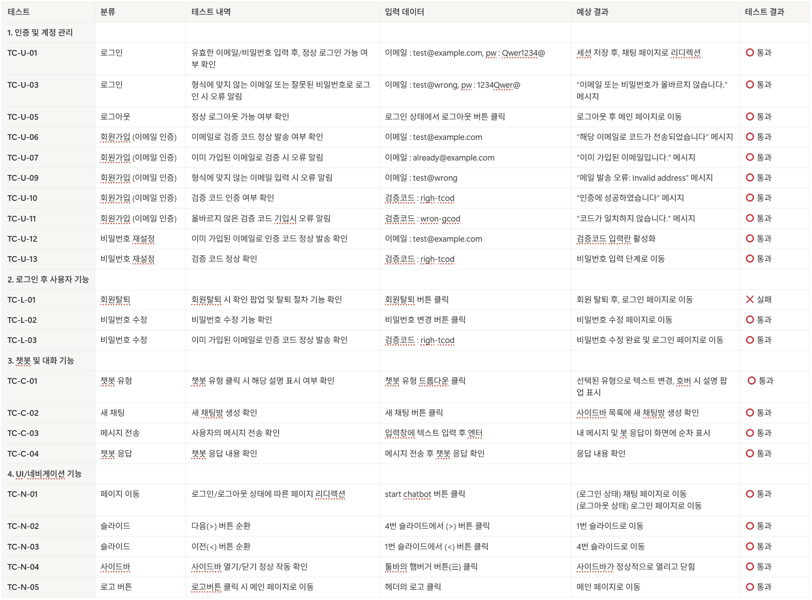

# 🏠 SK네트웍스 Family AI 캠프 17기 4차 프로젝트  

## 1️⃣ 팀 소개
### 팀명 : ROOM MATE  
> 사용자의 가장 가까운 주거 파트너가 되어 안정적인 시작을 돕는 의미  

| 김주서 | 김태완 | 성기혁 | 양송이 | 임산별 |
|:---:|:---:|:---:|:---:|:---:|
|  |  |  |  |  |
| [@kimjuseo71](https://github.com/kimjuseo71) | [@Kicangel](https://github.com/Kicangel) | [@venus241004](https://github.com/venus241004) | [@songeeeey](https://github.com/songeeeey) | [@ImMountainStar](https://github.com/ImMountainStar) |

---

## 2️⃣ 프로젝트 개요
### ✔ 프로젝트 명  
**청년과 신혼부부를 위한 주택청약 도우미 챗봇**

### ✔ 프로젝트 소개  
복잡한 청약 절차를 쉽게 이해하고 본인 조건에 맞는 공고·대출·주거 지원 정책을 한눈에 확인할 수 있는 통합형 RAG 챗봇 서비스입니다.  
벡터 DB와 한국어 LLM을 연동하여 정책 문서·FAQ·공고문에서 근거를 검색하고, 정확하고 신뢰도 높은 맞춤형 답변을 제공합니다.

### ✔ 프로젝트 필요성 및 배경  
- 청약 정보가 여러 기관에 산재되어 접근성 낮음  
- 제도 개편과 복잡한 공급방식 탓에 이해 어려움  
- 개인 조건(연령·소득 등)에 따라 적용 정책 상이  

👉 따라서 **통합형 챗봇** 을 통해 정보를 한 곳에서 제공해야 함  

### ✔ 프로젝트 목표  
- 공식 문서 기반의 정확한 청약 정보 제공  
- 사용자 기억 및 조건 기반 맞춤형 정책 추천  
- 청약 공고, 주택 매물, 대출 정보 통합 지원  

---

## 3️⃣ 기술 스택
| 구분 | 내용 |
|------|------|
| **언어** |  |
| **프레임워크** |   |
| **임베딩 모델** |  |
| **벡터 DB** |  |
| **LLM** |  |
| **협업** |    |

---

## 4️⃣ 시스템 구성도

---

## 5️⃣ 요구사항 정의서

**주요 기능**
1. 청약 및 대출 정보 기반 질의응답  
2. 사용자 피드백 수집 및 모델 고도화  
3. 대화 기록 저장 및 다운로드 기능  

---

## 6️⃣ 화면설계서
| 페이지 | 설명 |
|--------|------|
| 메인 화면 | 서비스 소개 및 시작 버튼 |
| 채팅 화면 | 사용자 입력, 응답 출력, 채팅로그 관리 |
| 피드백 화면 | 상담 종료 후 만족도 평가 기능 |

> 화면 설계서는 PDF 또는 이미지 캡처로 첨부  

---

## 7️⃣ WBS

---

## 8️⃣ 테스트 계획 및 결과 보고서
| 항목 | 주요 내용 |
|------|-----------|
| **테스트 목적** | 응답 정확성·속도 · 일관성 검증 |
| **성능 지표** | Answer Relevance / Correctness / Groundedness |
| **결과** | 정확도 높음 (근거 문서 기반 응답 우수) · 응답 속도 개선 필요 |

---

## 9️⃣ 수행 결과 (테스트/시연 페이지)

---

## 🔟 한 줄 회고
| 이름 | 회고 내용 |
|------|------------|
| 김태완 | LLM 모델 설계 과정을 직접 경험하며 이론과 실무의 연결을 배웠습니다. |
| 성기혁 | 프롬프트 엔지니어링과 DB 구축을 직접 구현하며 LLM 활용 감각을 익혔습니다. |
| 임산별 | 데이터 전처리부터 성능 향상 실험까지 전 단계를 직접 수행했습니다. |
| 양송이 | 환경 구축 과정에서 여러 문제를 해결하며 안정성의 중요성을 느꼈습니다. |
| 김주서 | 서로 다른 형태의 데이터를 통합하는 과정이 가장 어려웠지만, 데이터 설계의 핵심을 배웠습니다. |

---

## 🌈 발전 방향
- 평균 응답 속도 최적화 및 형식 일관성 강화  
- 데이터 범위 확장 : 주택 청약 → 생활 지원 · 정책 정보  
- 사용자 맞춤형 계산 기능 추가 (소득 기준·보증금 전환 등)

---

> © 2025 Room Mate Team – SK Networks Family AI Camp 17th Project 4
