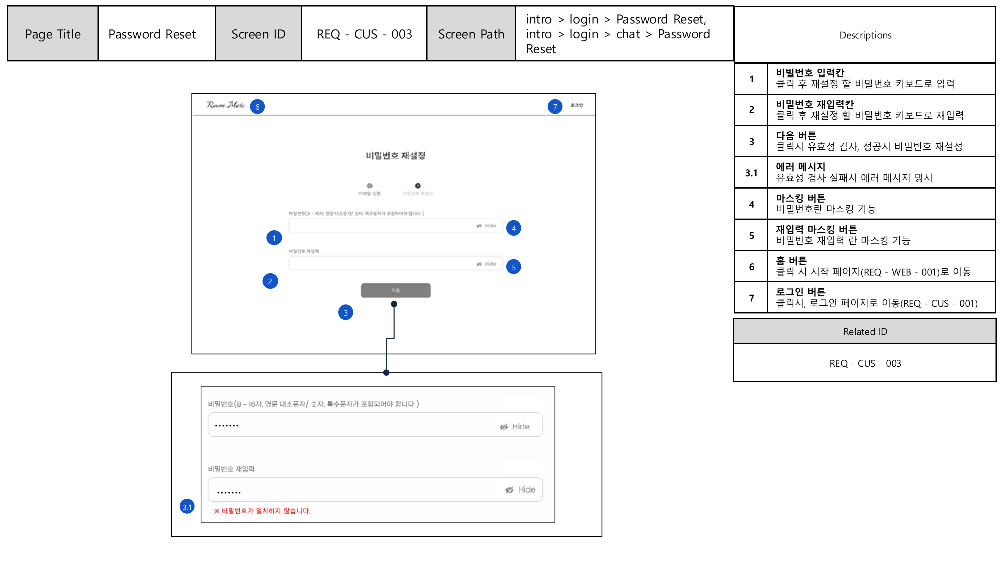

<file name=0 path=/Users/sanbyeol/Desktop/SKN17/PJ4_sub/README.md># SK NETORKS AI CAMP 17기 - 4th - 2Team 
- 주제 : LLM을 연동한 내외부 문서 기반 질의 응답 웹페이지 개발
- 개발 기간 : 2025.10.23 ~ 2025.10.27

# 목차 
- [01. 팀 소개](#1️⃣-팀-소개)
- [02. 프로젝트 개요](#2️⃣-프로젝트-개요)
- [03. 기술 스택](#3️⃣-기술스택-및-사용한-모델)
- [04. WBS](#5️⃣-wbs)
- [05. 요구사항 정의서](#6️⃣-요구사항명세서)
- [06. 화면설계서](#6️⃣-요구사항명세서)
- [07. 시스템 아키텍처](#7️⃣-시스템-아키텍처)
- [08. 테스트 계획 및 결과](#8️⃣-테스트-계획-및-결과)
- [09. 수행 결과 및 향후 개선점](#9️⃣-수행-결과-및-향후-개선점)
- [10. 한 줄 회고](#🔟-한-줄-회고)

# 1️⃣ 팀 소개 

## ✅ 팀명 : ROOM MATE 🏠
사용자의 가장 가까운 주거 파트너가 되어 안정적인 시작을 도와주 주택청약 도우미 챗봇 

## ✅ 팀원 소개 
| 김주서 | 김태완 | 성기혁 | 양송이 | 임산별 |
|:---:|:---:|:---:|:---:|:---:|
|  |  |  |  |  |
| [@kimjuseo71](https://github.com/kimjuseo71) | [@Kicangel](https://github.com/Kicangel) | [@venus241004](https://github.com/venus241004) | [@songeeeey](https://github.com/songeeeey) | [@ImMountainStar](https://github.com/ImMountainStar) |
 

# 2️⃣ 프로젝트 개요 
## ✅ 2.1  프로젝트 명 | 청년과 신혼부부를 위한 주택청약 상담 웹 서비스 

## ✅ 2.2 프로젝트 소개 
- 사용자가 **복잡한 청약 절차**를 손쉽게 이해하고, 본인 조건에 맞는 물량과 주거지원까지 바로 확인할 수 있는 **통합형 챗봇 서비스**를 제공하는 웹 서비스입니다. 
- **공신력 있는 공공기관 자료**(국토교통부, LH·SH공사)의 실제 공고문과 정책 데이터를 기반으로, **정확하고 맞춤화된 청약 정보**를 제공합니다.

## ✅ 2.3 프로젝트 필요성 
### (1) 프로젝트 배경 : 상황분석
🏠 주택청약의 공급과 수요 증가 
> **청약통장 가입자, 2년 9개월 만에 증가…·청약 혜택 확대 통했나**  
> 3월 가입자 전월 대비 4435명 증가…
> 3기 신도시 기대감  
> 정부, 청년·신혼부부 청약 혜택 확대  
>  
> *박영규 기자, [이코노믹리뷰](https://www.econovill.com/news/articleView.html?idxno=693037), 2025.04.22 23:14*

> 💡 주택청약에 대한 관심과 이용자는 꾸준히 증가하고 있는 상황 
 

### (2) 문제 분석 
🔎 [ 주택청약 관심도와 신청과정에 대한 설문조사 ]  
  •	조사 대상: 20~30대 청년층 중심 
	•	조사 기간: 2025년 10월 24일 ~ 26일  
	•	조사 목적: 주택청약 정보 접근성과 챗봇 서비스 필요성 파악 

 
> 💡 주택청약에 대한 높은 관심은 있지만, 주택청약 관련 정보획득에 어려움이 존재함 
 

🔎 [ 주택청약 관심도와 신청과정에 대한 In-Depth Interview ]

🔎 [ 복잡한 청약절차 과정 ]
 

| [청약 절차 과정](https://hkpm.co.kr/%EC%95%84%ED%8C%8C%ED%8A%B8-%EC%9D%BC%EB%B0%98-%EB%B6%84%EC%96%91-%EC%B2%AD%EC%95%BD-%EC%A0%88%EC%B0%A8-%EC%88%9C%EC%84%9C-2024/) | [청약 신청 및 가점 계산](https://news.bizwatch.co.kr/article/real_estate/2019/09/06/0001) |
|---|---|
|  |  |

- 잦은 제도 개편과 복잡한 공급방식 및 자격 요건으로 **복잡도** 증가
- 다양한 공급방식과 공급처로 인해 정보가 **산발적**으로 존재함
- 주택청약 정보를 종합적으로 제공처의 부재 
> 💡 주택청약 제도의 복잡함으로 인한 **사용자의 불편함** 존재 
 

### (3) 문제 정의
1. **정보 접근성의 한계**  
   - 청약 관련 정보가 국토교통부, SH/LH, 지자체 등 여러 사이트에 흩어져 있어, 사용자가 원하는 정보를 한 번에 얻기 어려움  

2. **복잡한 청약 절차 구조**  
   - 자격 확인 → 청약 신청 → 당첨 확인 → 대출 및 입주까지 이어지는 절차가 복잡하며, 제도 변경도 잦아 사용자가 전체 과정을 이해하고 준비하는 데 어려움이 큼

3. **개인 맞춤형 정보 부족**  
   - 연령, 소득, 무주택 기간 등 개인 조건에 따라 가능한 공고와 대출 상품이 달라지지만, 이를 **한눈에 확인할 수 있는 서비스 부재**

> 💡 공급 확대와 관심 증가에도 불구하고, 정보 접근의 분산성과 제도 복잡성이 청약 진입 장벽으로 작용
 

> 💡 신뢰할 수 있는 데이터를 기반으로, 청약 절차를 통합해주는 웹 서비스가 필요함 
 
----
### (4) 프로젝트 목적 
- 주택청약 관련 공식 문서와 공고문 데이터를 기반으로 신뢰도 높은 정보를 제공하는 **챗봇 웹서비스 구현**
- 사용자 개인의 조건(연령, 소득, 무주택 기간 등)에 따라 맞춤형 공고, 매물, 주거지원정책 정보를 제공
- **대화형 인터페이스**를 통해 청약 절차·정보 탐색·공고 추천 과정을 간소화하고, 전체 청약 프로세스를 한 곳에서 지원
 
-----
 

# 3️⃣ 기술스택
## 3.1 기술스택
| 카테고리 | 기술 스택 |
|----------|-----------|
| **개발 언어** |  |
| **개발 도구** |    |
| **벡터 DB** |  |
| **사용 모델** |    |
| **서버** |     |
| **추론 서버** |   |
| **데이터베이스** |  |
| **협업 도구** |   |
| **프론트엔드** |   |

 

---

# 4️⃣ WBS 
[🔗 WBS 구글 드라이브](https://docs.google.com/spreadsheets/d/1kz7RMf0SV2hCc74jAFm7UAGFna9LBW-TEkAd6hnelKc/edit?usp=sharing)

 

# 5️⃣ 요구사항 명세서 
[🔗 요구사항 명세서 구글 드라이브](https://docs.google.com/spreadsheets/d/126VGwogx4I7AnjeoOFfWYTbYr2ocJjFrdAXC-5z1lK4/edit?pli=1&gid=0#gid=0)

 
 

# 6️⃣ 화면설계서

Intro Page
|  |
|------|
|  |

Login Page
|  |
|------|
|  |

Password Reset Page
|  |  |
|--------|--------|
|  |  |

Password Modify Page
|  |  |
|--------|--------|
|  |  |

Sign Page
| | |   |
|--------|--------|--------|
|  |  |  |

Chat Page
|  |  |
|--------|--------|
|  |  |
 

# 7️⃣ 시스템 아키텍처

# 8️⃣ 테스트 계획 및 결과 

# 9️⃣ 수행 결과 및 향후 개선점 

## ✅ 9.1 수행결과 (테스트/시연 페이지)

### 🙋 사용자 페르소나 
**주택청약 청년 대상 페르소나 & 사용자 분석**

#### 🔍 사용자 분석 
- **Needs**: 강동구에서 대출 기반으로 보증금 1억 이하 안정적인 주거 정보를 한눈에 파악할 수 있는 통합 플랫폼 필요
- **Pain Points**: 복잡한 청약 절차와 정보가 여러 사이트에 분산되어 있어, 효율적인 탐색과 비교가 어려움
- **Expected Value**: 챗봇과 통합된 웹서비스를 통해 개인 조건 기반의 공고, 청약 자격, 대출 정보 등을 한번에 확인

#### ⛳️ 고객 여정 기반 시나리오

| 고객 여정 단계 | 사용자 행동 | 
|----------------|--------------|
| 1. 진입 | 웹페이지 접속 → 서비스 소개 확인 | 
| 2. 챗봇 시작 클릭 | 'Start Chatbot' 클릭 → 로그인 페이지 이동 | 
| 3. 로그인 | 이메일과 비밀번호 입력 | 
| 4. 챗봇 사용 (유형 선택) | 청년 유형 선택 | 
| 5. 챗봇 사용 (질문 입력) |  ① “제가 보증금 1억 이하 전세를 청약할 수 있나요?” ② “제 조건으로 어떤 공고에 지원 가능해요?” | 공
| 6. 개인정보 확인 | 챗봇 페이지 내 정보 모달 클릭 | 
| 7. 비밀번호 수정 | 상단 메뉴 → 비밀번호 변경 |
| 8. 로고 클릭 | 상단 로고 클릭 |
| 9. 챗봇 재진입 | 메인 페이지 'Start Chatbot' 클릭 | 
| 10. 회원 탈퇴 | 마이페이지 → 회원 탈퇴 선택 |

 

##  ✅ 9.2 기대효과 
- 개인화된 상호작용 : 사용자의 나이, 소득, 자산, 청약 통장 등 맥락 정보를 반영하여 맞춤형 주택 정보, 정책 및 대출 상품을 제공 → 불필요한 정보 탐색 시간 절감
- 접근성 및 신정확성 확대 : 흩어진 공식 공고문, 정책 자료, FAQ 등 복잡한 정보를 통합해 간단한 인터페이스로 제공 → 주거 지원 정보 접근성 강화
- 시간 및 비용 절감 : 공고 확인, 자격 검증, 가점 계산, 대출 가능 여부 파악 등 복잡한 절차를 챗봇이 자동화 → 사용자 입장에서 절차 소요 시간 단축 및 정보 탐색 비용 감소

## ✅ 9.3 향후 개선점 
1. 응답 속도 최적화 : 평균 3분 이상 걸리는 응답 지연 문제를 해결하기 위해 프롬프트 경량화, 모델 최적화 기법 적용
2. 응답 형식 일관성 강화 : 동일/유사 질문에 대해 구조와 톤이 일관되도록 출력 템플릿 설계
3. 데이터 소스 확대 : 현재 주택 청약·대출 중심의 데이터에서 다양한 정책·지원 제도까지 통합하여 정보 범위 확장
4. 개인화 고도화 : 소득 계산, 월세-보증금 전환 계산 등 사용자 맞춤형 계산 기능을 제공하여 더욱 정밀한 개인화 서비스 구현

# 🔟 한 줄 회고 
<table>
  <tr>
    <th style="width:80px;">이름</th>
    <th>회고 내용</th>
  </tr>
  <tr>
    <td>김태완</td>
    <td> </td>
  </tr>
  <tr>
    <td>성기혁</td>
    <td> </td>
  </tr>
  <tr>
    <td>임산별</td>
    <td> </td>
  </tr>
  <tr>
    <td>양송이</td>
    <td> </td>
  </tr>
  <tr>
    <td>김주서</td>
    <td> </td>
  </tr>
</table>

 
</file>
